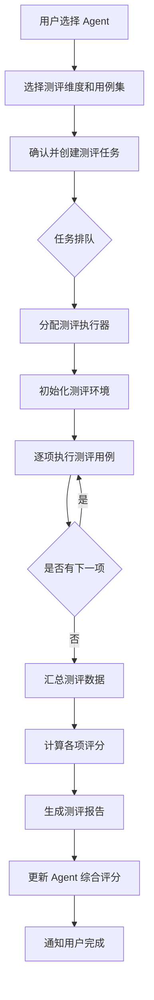
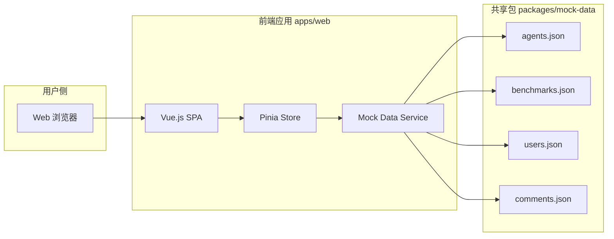
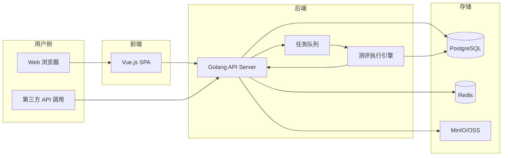
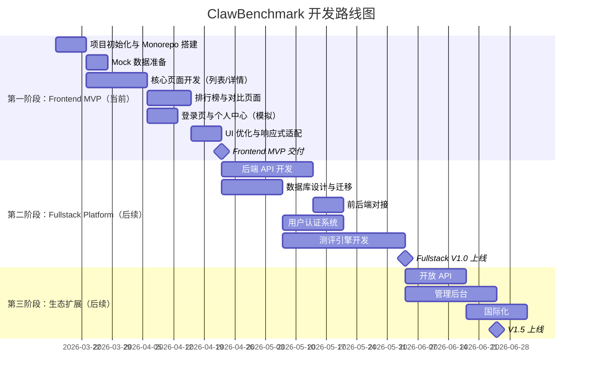

# ClawBenchmark 产品需求文档 (PRD)

---

## 文档信息

| 字段       | 内容                                      |
| ---------- | ----------------------------------------- |
| 产品名称   | ClawBenchmark                             |
| 文档版本   | v1.2.0                                    |
| 创建日期   | 2026-03-11                                |
| 最后更新   | 2026-03-12                                |
| 文档负责人 | -                                         |
| 文档状态   | 初稿                                      |
| 审批状态   | 待审批                                    |

### 版本更新记录

| 版本   | 日期       | 修改人 | 修改内容     |
| ------ | ---------- | ------ | ------------ |
| v1.0.0 | 2026-03-11 | -      | 初始版本创建 |
| v1.1.0 | 2026-03-12 | -      | 调整为前端 MVP 优先策略，预留 monorepo 架构 |
| v1.2.0 | 2026-03-12 | -      | 明确当前阶段仅开发前端页面，使用 mock 数据，完善 monorepo 架构说明 |

---

## 1. 产品概述

### 1.1 产品背景

随着大语言模型（LLM）能力的快速提升，以 OpenClaw、AutoGPT、CrewAI、LangChain Agent 为代表的自主 AI Agent 框架大量涌现。这些框架具备通过自然语言自动化执行复杂任务的能力，可连接 Slack、Discord、Telegram、微信等多种平台。

然而，目前市场上缺乏一个权威、客观、可量化的测评平台来帮助用户对比不同 Agent 框架的综合表现。开发者在选型时缺少可靠数据参考，企业决策者难以评估不同方案的投入产出比，普通用户对各框架的能力边界认知模糊。

ClawBenchmark 正是为解决这一痛点而生。

### 1.2 产品定位

ClawBenchmark 是一个面向公众的、开放的自主 AI Agent 框架测评网站。通过标准化的测评体系，从功能性、性能、安全性三大维度对各类 Agent 框架进行系统评估，并以直观的排行榜、对比图表和详细报告呈现结果。

### 1.3 产品阶段规划

本产品采用分阶段交付策略，当前阶段与后续阶段的范围明确区分如下：

**当前阶段：Frontend MVP（前端展示型产品）**

本阶段聚焦于前端页面开发，目标是快速构建高保真的展示型产品原型，用于验证产品设计、用户体验和视觉呈现。所有数据采用本地 mock data / 静态 JSON，所有交互以前端演示为主，不涉及后端 API、数据库、认证服务和测评引擎的开发。

当前阶段核心目标：
- 完成所有核心页面的 UI 实现（Agent 列表、排行榜、对比页、详情页、登录页、个人中心等）
- 使用 mock 数据模拟真实业务场景，覆盖各页面所需的数据结构
- 验证交互流程和用户体验
- 建立 monorepo 项目架构，为后续全栈开发预留扩展空间

**后续阶段：Fullstack Platform（全栈测评平台）**

在前端 MVP 验证通过后，将逐步补充以下模块：
- 后端 API 服务（Golang）
- 数据库（PostgreSQL）与缓存（Redis）
- 用户认证系统（JWT + OAuth）
- 自动化测评引擎
- 开放 API 与管理后台
- 部署与运维体系

### 1.4 产品愿景

成为自主 AI Agent 领域最受信赖的第三方测评平台，为行业提供客观、透明、可复现的评估标准。

### 1.5 价值主张

| 用户群体   | 核心价值                                             |
| ---------- | ---------------------------------------------------- |
| 开发者     | 快速对比框架能力，辅助技术选型，了解各框架优劣势     |
| 企业决策者 | 获取量化数据支撑采购决策，评估 TCO（总拥有成本）     |
| 普通用户   | 直观了解各 Agent 的能力范围，选择适合自身需求的工具   |
| 框架作者   | 获得第三方客观评价，发现改进方向，提升产品竞争力     |

---

## 2. 用户分析

### 2.1 目标用户画像

**画像 A：技术开发者**

- 年龄：22-40 岁
- 背景：软件工程师、AI 工程师、独立开发者
- 诉求：对比不同 Agent 框架的 API 易用性、扩展性、性能指标，进行技术选型
- 使用频率：中高频（周度或项目初期密集使用）
- 技术水平：熟悉编程，能理解技术指标和 API 文档

**画像 B：企业决策者**

- 年龄：30-50 岁
- 背景：技术总监、产品经理、CTO
- 诉求：了解各框架的综合表现（性能、成本、安全性），评估 ROI
- 使用频率：低频（采购评估阶段）
- 技术水平：有一定技术理解力，更关注整体结论和可视化呈现

**画像 C：普通用户/AI 爱好者**

- 年龄：18-50 岁
- 背景：对 AI Agent 感兴趣的普通互联网用户
- 诉求：了解哪些 Agent 好用、能做什么、排名如何
- 使用频率：低频（浏览为主）
- 技术水平：非技术背景，需要简洁直观的信息呈现

### 2.2 核心用户场景

| 编号 | 场景名称                 | 用户角色   | 场景描述                                                                                 | 阶段       |
| ---- | ------------------------ | ---------- | ---------------------------------------------------------------------------------------- | ---------- |
| S01  | 浏览排行榜               | 所有用户   | 用户访问首页，查看各 Agent 框架的综合排名和关键指标                                       | Frontend MVP |
| S02  | 对比两个 Agent           | 开发者     | 用户选择两个或多个 Agent，在同一页面从多维度进行对比                                       | Frontend MVP |
| S03  | 查看详细测评报告         | 开发者     | 用户点击某个 Agent，查看其完整的测评结果、各项指标得分和历史变化趋势                       | Frontend MVP |
| S04  | 登录与个人中心           | 所有用户   | 用户在登录页面进行模拟登录，查看个人中心页面                                               | Frontend MVP |
| S05  | 提交自定义测评           | 开发者     | 用户登录后，通过平台对某个 Agent 发起自定义测评任务并查看结果                               | Fullstack  |
| S06  | 评论讨论                 | 所有用户   | 用户对某个 Agent 的测评结果发表评论、分享使用体验                                         | Fullstack  |
| S07  | 通过 API 提交测评数据     | 第三方平台 | 第三方测评工具或 CI/CD 流水线通过 API 向平台提交测评结果                                   | Fullstack  |
| S08  | 注册新 Agent 信息        | 框架作者   | Agent 框架的开发者在平台上注册自己的 Agent 信息，供社区测评                                 | Fullstack  |

---

## 3. 功能需求

### 3.1 功能全景图

```
ClawBenchmark
|
|== Frontend MVP 阶段（当前） ====================
|
|-- 首页与导航
|   |-- 排行榜概览
|   |-- 全局搜索（前端本地搜索）
|   |-- 导航菜单
|
|-- Agent 目录
|   |-- Agent 列表（筛选/排序/搜索）
|   |-- Agent 详情页
|
|-- 结果展示
|   |-- 排行榜（综合/分维度）
|   |-- 多维度对比
|   |-- 详细报告
|   |-- 基础图表（雷达图/柱状图）
|
|-- 用户系统（前端模拟）
|   |-- 登录页（mock 登录流程）
|   |-- 个人中心（静态展示）
|
|== Fullstack 阶段（后续） =======================
|
|-- Agent 目录（扩展）
|   |-- Agent 注册与编辑（需后端支撑）
|
|-- 测评体系
|   |-- 测评任务管理（创建/执行/查看）
|   |-- 测评用例库
|   |-- 测评执行引擎
|
|-- 结果展示（扩展）
|   |-- 历史趋势（需真实时序数据）
|   |-- 数据导出
|
|-- 用户系统（完整）
|   |-- 注册/登录（邮箱 + GitHub OAuth）
|   |-- 个人中心（真实数据）
|   |-- 评论讨论
|
|-- 开放平台
|   |-- API 接口
|   |-- API 文档
|   |-- API Key 管理
|
|-- 管理后台
|   |-- Agent 审核
|   |-- 测评数据管理
|   |-- 用户管理
|   |-- 内容审核
```

### 3.2 功能优先级总览

| 优先级 | 功能模块             | 说明                           | 阶段           |
| ------ | -------------------- | ------------------------------ | -------------- |
| P0     | Agent 目录           | 核心信息承载，所有功能的基础   | Frontend MVP   |
| P0     | 排行榜与结果展示     | 平台核心价值，用户第一诉求     | Frontend MVP   |
| P0     | 用户系统（页面）     | 登录页和个人中心页面           | Frontend MVP   |
| P1     | 数据可视化           | 提升信息传达效率               | Frontend MVP   |
| P1     | 测评任务管理         | 支撑测评流程，产生测评数据     | Fullstack      |
| P1     | 评论讨论             | 社区互动，提升用户粘性         | Fullstack      |
| P1     | 用户系统（完整）     | 真实注册登录、认证、角色管理   | Fullstack      |
| P2     | 开放 API             | 生态扩展，第三方集成           | Fullstack      |
| P2     | 管理后台             | 运营管理，可先用简易后台替代   | Fullstack      |

### 3.3 功能详细描述

---

#### 3.3.1 Agent 目录（P0）

**功能说明**：提供所有被测评 Agent 框架的集中展示、检索和管理功能。

**用户故事**：

- 作为一名开发者，我想浏览所有可用的 Agent 框架列表，以便快速找到我感兴趣的框架。
- 作为一名框架作者，我想提交自己的 Agent 框架信息到平台，以便获得社区测评。
- 作为一名普通用户，我想通过搜索和筛选找到特定类型的 Agent，以便了解其能力。

**功能清单**：

| 子功能          | 描述                                                             | 优先级 | 阶段           |
| --------------- | ---------------------------------------------------------------- | ------ | -------------- |
| Agent 列表页    | 展示所有 Agent 的卡片/列表视图，支持分页                         | P0     | Frontend MVP   |
| 搜索与筛选      | 按名称搜索，按类型、评分、支持平台等筛选（前端本地实现）         | P0     | Frontend MVP   |
| 排序             | 按综合评分、更新时间、热度等排序（前端本地实现）                 | P0     | Frontend MVP   |
| Agent 详情页    | 展示 Agent 的完整信息、测评结果、评论（mock 数据）                | P0     | Frontend MVP   |
| Agent 注册      | 允许认证用户提交新 Agent 信息（需审核）                           | P1     | Fullstack      |
| Agent 编辑      | Agent 拥有者可编辑自己提交的 Agent 信息                           | P1     | Fullstack      |

**当前阶段（Frontend MVP）实现说明**：

- 所有 Agent 数据来自 `packages/mock-data/agents.json`
- 搜索和筛选功能在前端使用 JavaScript 数组方法（filter、includes 等）实现
- 排序功能在前端使用 Array.sort 实现
- 不涉及后端 API 调用和数据库查询
- 详情页评论区展示 mock 评论数据，不支持真实发表评论
- Agent 注册和编辑功能在当前阶段不实现

**Agent 数据模型**：

```
Agent {
  id: string                    // 唯一标识
  name: string                  // 名称（如 "OpenClaw"）
  slug: string                  // URL 友好标识（如 "openclaw"）
  logo_url: string              // Logo 图片地址
  description: string           // 简短描述（200 字以内）
  full_description: string      // 完整描述（支持 Markdown）
  website_url: string           // 官方网站
  repo_url: string              // 源码仓库地址
  license: string               // 开源协议（如 "MIT"）
  version: string               // 最新版本号
  category: enum                // 类型分类（通用Agent/任务自动化/代码生成/...）
  supported_platforms: []string // 支持的平台（Slack/Discord/Telegram/微信/...）
  supported_llms: []string      // 支持的 LLM（GPT-4/Claude/Llama/...）
  architecture_type: string     // 架构类型（Pipeline/DAG/ReAct/...）
  is_open_source: bool          // 是否开源
  is_self_hosted: bool          // 是否支持自托管
  tags: []string                // 标签
  submitted_by: string          // 提交者 user_id
  status: enum                  // 状态（pending/approved/rejected/archived）
  overall_score: float          // 综合评分（0-100）
  scores: {                     // 各维度评分
    functionality: float
    performance: float
    security: float
  }
  created_at: timestamp
  updated_at: timestamp
}
```

**界面要求**：

- 列表页：支持卡片视图和表格视图切换
- 卡片视图包含：Logo、名称、简短描述、综合评分、关键标签
- 详情页采用左右布局：左侧为基础信息，右侧为测评结果和图表
- 响应式设计，适配移动端

---

#### 3.3.2 测评体系（P1 - Fullstack 阶段）

**功能说明**：定义测评维度、管理测评任务、执行测评流程、记录测评结果。本模块属于后续 Fullstack 阶段的开发范围，当前 Frontend MVP 阶段仅使用 mock 测评数据进行页面展示。

**用户故事**：

- 作为一名开发者，我想对某个 Agent 发起一组功能性测评，以便量化其任务完成能力。
- 作为一名平台管理员，我想定义标准化的测评用例集，以便保证测评结果的可比性。
- 作为一名用户，我想查看测评任务的执行状态和进度，以便知道结果何时可用。

**测评维度定义**：

##### 维度一：功能性测评

| 指标             | 说明                                     | 评分方式       |
| ---------------- | ---------------------------------------- | -------------- |
| 任务完成率       | 在标准任务集上成功完成任务的比例          | 百分比（0-100）|
| 工具使用能力     | 正确调用外部工具/API 的能力              | 评分（0-100）  |
| 多步骤推理       | 分解复杂任务并按序执行的能力              | 评分（0-100）  |
| 上下文理解       | 在长对话/长文本中保持上下文的能力         | 评分（0-100）  |
| 多平台集成       | 接入不同平台（Slack/Discord/...）的能力   | 支持平台数量   |
| 容错与恢复       | 遇到错误后自动修正和恢复的能力            | 评分（0-100）  |

##### 维度二：性能测评

| 指标             | 说明                                     | 单位           |
| ---------------- | ---------------------------------------- | -------------- |
| 首次响应时间     | 从输入到首次输出的延迟                    | 毫秒（ms）     |
| 端到端完成时间   | 完成完整任务的总耗时                      | 秒（s）        |
| 吞吐量           | 单位时间内处理的请求数量                  | 请求/秒        |
| 并发处理能力     | 同时处理多个任务的能力                    | 最大并发数     |
| CPU 占用         | 任务执行期间的 CPU 资源消耗              | 百分比         |
| 内存占用         | 任务执行期间的内存资源消耗               | MB             |
| Token 消耗       | 完成任务使用的 token 数量                | 数量           |
| 成本估算         | 按 token 价格估算的单次任务成本          | USD            |

##### 维度三：安全性测评

| 指标             | 说明                                     | 评分方式       |
| ---------------- | ---------------------------------------- | -------------- |
| 数据隐私保护     | 对用户敏感数据的处理和保护程度            | 评分（0-100）  |
| 权限控制         | 细粒度权限管理和最小权限原则的实施        | 评分（0-100）  |
| 输入过滤/注入防护| 对 prompt injection 等攻击的抵御能力      | 评分（0-100）  |
| 沙箱隔离         | 代码执行和文件系统的隔离程度              | 评分（0-100）  |
| 漏洞扫描         | 已知安全漏洞的数量和严重程度              | CVE 数量/等级  |
| 审计日志         | 操作审计和日志记录的完整性                | 评分（0-100）  |

**功能清单**：

| 子功能             | 描述                                                           | 优先级 |
| ------------------ | -------------------------------------------------------------- | ------ |
| 测评用例库         | 预定义的标准测评任务集，按维度分类                              | P1     |
| 创建测评任务       | 用户选择 Agent 和测评用例集，创建测评任务                       | P1     |
| 测评执行           | 后台执行测评任务，实时更新进度                                  | P1     |
| 结果记录           | 自动记录各项指标数据，计算综合评分                              | P1     |
| 测评任务列表       | 查看所有测评任务的状态和结果                                    | P1     |
| 测评历史           | 查看某个 Agent 的历史测评记录和趋势                             | P1     |
| 自定义测评用例     | 用户创建自定义测评用例（高级功能）                              | P2     |

**测评任务数据模型**：

```
BenchmarkTask {
  id: string
  agent_id: string              // 被测 Agent
  agent_version: string         // 被测版本
  test_suite_id: string         // 使用的测评用例集
  dimension: enum               // 测评维度（functionality/performance/security）
  status: enum                  // pending/running/completed/failed/cancelled
  progress: int                 // 执行进度（0-100）
  started_at: timestamp
  completed_at: timestamp
  created_by: string            // 发起者 user_id
  environment: {                // 测评环境信息
    os: string
    cpu: string
    memory: string
    llm_provider: string
    llm_model: string
  }
  results: BenchmarkResult      // 测评结果
  created_at: timestamp
}

BenchmarkResult {
  id: string
  task_id: string
  agent_id: string
  dimension: string
  overall_score: float          // 该维度综合得分（0-100）
  metrics: []MetricResult       // 各项指标结果
  raw_data: json                // 原始数据（供高级用户分析）
  summary: string               // 结果摘要
  created_at: timestamp
}

MetricResult {
  metric_name: string           // 指标名称
  value: float                  // 数值
  unit: string                  // 单位
  score: float                  // 归一化评分（0-100）
  details: json                 // 详细数据
}
```

**测评任务流程**：



---

#### 3.3.3 排行榜与结果展示（P0）

**功能说明**：以排行榜、对比图表、详细报告等形式展示测评结果。

**用户故事**：

- 作为一名普通用户，我想看到一个简洁明了的排行榜，以便快速了解哪个 Agent 最强。
- 作为一名开发者，我想对比两个 Agent 在各维度的表现差异，以便做出选型决策。
- 作为一名企业决策者，我想看到详细的成本分析，以便评估使用成本。

**功能清单**：

| 子功能           | 描述                                                             | 优先级 | 阶段           |
| ---------------- | ---------------------------------------------------------------- | ------ | -------------- |
| 综合排行榜       | 按综合评分排名，展示 Top N Agent                                 | P0     | Frontend MVP   |
| 分维度排行榜     | 按功能性/性能/安全性单独排名                                     | P0     | Frontend MVP   |
| Agent 对比       | 选择 2-4 个 Agent 进行多维度并排对比                             | P0     | Frontend MVP   |
| 详细测评报告     | 单个 Agent 的完整测评报告页面                                    | P0     | Frontend MVP   |
| 雷达图           | 多维度能力雷达图（按测评维度和子指标展开）                       | P1     | Frontend MVP   |
| 历史趋势图       | Agent 评分随版本/时间变化的折线图                                | P1     | Fullstack      |
| 成本效益分析     | 各 Agent 的 token 消耗和成本对比图                               | P1     | Fullstack      |
| 数据导出         | 将测评数据导出为 CSV/JSON                                        | P2     | Fullstack      |

**当前阶段（Frontend MVP）实现说明**：

- 排行榜数据基于 mock 数据中的评分字段，在前端实时计算排名
- 对比功能使用 mock 数据进行多维度展示
- 雷达图和柱状图使用 ECharts 渲染 mock 数据
- 历史趋势图因需要真实时序数据，推迟到 Fullstack 阶段实现

**界面要求**：

排行榜页面：

- 默认展示综合排行榜，支持切换到分维度排行
- 表格形式，列包含：排名、Agent 名称/Logo、综合评分、功能性评分、性能评分、安全性评分、最后测评时间
- 点击行可展开快速预览，再次点击进入详情
- 支持筛选：按类型、是否开源、支持平台等

对比页面：

- 左右或上下并排布局
- 包含雷达图叠加对比
- 各指标数值对照表格
- 高亮显示胜出项

详细报告页面：

- 顶部摘要区：综合评分、评级（如 A+/A/B+...）、一句话总结
- 中部图表区：雷达图 + 各维度柱状图
- 底部详细数据区：各指标的具体数值、测评方法说明、原始数据链接

---

#### 3.3.4 用户系统（P0/P1）

**功能说明**：用户注册登录、个人中心、评论讨论功能。

**用户故事**：

- 作为一名新用户，我想通过邮箱快速注册账号，以便参与平台互动。
- 作为一名已注册用户，我想对某个 Agent 的测评结果发表评论，以便分享我的使用体验。
- 作为一名活跃用户，我想查看我提交过的测评和评论记录，以便管理我的内容。

**功能清单**：

| 子功能         | 描述                                                       | 优先级 | 阶段           |
| -------------- | ---------------------------------------------------------- | ------ | -------------- |
| 登录页         | 登录页面 UI，支持邮箱和 GitHub 登录入口                    | P0     | Frontend MVP   |
| 个人中心页     | 个人信息展示、我的测评、我的评论等页面                      | P0     | Frontend MVP   |
| 模拟登录流程   | 前端 localStorage 存储模拟 token，无真实验证                | P0     | Frontend MVP   |
| 邮箱注册/登录  | 真实邮箱 + 密码注册和登录                                  | P0     | Fullstack      |
| 第三方登录     | 真实 GitHub OAuth 登录                                      | P0     | Fullstack      |
| 评论系统       | 对 Agent 测评结果发表评论，支持嵌套回复                     | P1     | Fullstack      |
| 消息通知       | 评论被回复、测评完成等通知                                  | P2     | Fullstack      |
| 用户角色       | 普通用户/认证开发者/管理员三级角色                          | P1     | Fullstack      |

**当前阶段（Frontend MVP）实现说明**：

- 登录页面提供完整的 UI 界面（邮箱输入框、密码输入框、GitHub 登录按钮等）
- 点击登录后，前端直接从 mock 数据中匹配用户信息，将模拟 token 存入 localStorage
- 个人中心页面展示 mock 用户数据（头像、昵称、我的测评记录、我的评论等）
- 不涉及真实的密码验证、OAuth 回调、JWT 签发等后端逻辑

**用户数据模型**：

```
User {
  id: string
  email: string
  username: string
  display_name: string
  avatar_url: string
  role: enum                    // user/developer/admin
  github_id: string             // GitHub OAuth 关联
  bio: string
  company: string
  api_key: string               // 用于 API 调用
  is_verified: bool             // 邮箱是否验证
  created_at: timestamp
  updated_at: timestamp
}

Comment {
  id: string
  agent_id: string              // 关联的 Agent
  user_id: string
  parent_id: string             // 父评论 ID（嵌套回复）
  content: string               // 评论内容（支持 Markdown）
  upvotes: int
  status: enum                  // active/hidden/deleted
  created_at: timestamp
  updated_at: timestamp
}
```

---

#### 3.3.5 数据可视化（P1）

**功能说明**：通过图表将测评数据以直观、易理解的方式呈现。

**图表类型需求**：

| 图表类型     | 用途                                         | 使用场景                 |
| ------------ | -------------------------------------------- | ------------------------ |
| 雷达图       | 展示单个 Agent 的多维度能力分布              | Agent 详情页、对比页     |
| 柱状图       | 对比多个 Agent 在某一指标上的表现            | 排行榜、对比页           |
| 折线图       | 展示 Agent 评分随时间/版本的变化趋势         | 历史趋势页               |
| 堆叠条形图   | 展示成本构成（token 消耗、API 调用等）       | 成本分析页               |
| 散点图       | 展示性能-成本的分布关系                      | 成本效益分析页           |
| 热力图       | 展示各 Agent 在各指标上的得分矩阵            | 总览对比页               |
| 仪表盘       | 展示单项评分的直观呈现                       | Agent 详情页             |

**技术建议**：前端使用 ECharts 或 Apache ECharts 作为图表库，支持响应式和交互式图表。

---

#### 3.3.6 开放 API（P2 - Fullstack 阶段）

**功能说明**：提供 RESTful API 接口，允许第三方程序提交测评数据和查询测评结果。本模块属于后续 Fullstack 阶段的开发范围，当前 Frontend MVP 阶段不涉及。

**用户故事**：

- 作为一名开发者，我想通过 API 将我的 CI/CD 流水线中的测评结果自动提交到平台。
- 作为一名数据分析师，我想通过 API 批量获取测评数据进行自定义分析。

**API 模块设计**：

| API 模块       | 说明                               | 认证方式   |
| -------------- | ---------------------------------- | ---------- |
| Agent API      | 查询 Agent 列表和详情               | 公开/可选  |
| Benchmark API  | 提交测评结果、查询测评任务          | API Key    |
| Result API     | 查询测评结果和排行数据              | 公开/可选  |
| User API       | 用户信息管理                        | API Key    |

**核心 API 端点**：

```
# Agent 相关
GET    /api/v1/agents                    # 获取 Agent 列表
GET    /api/v1/agents/:slug              # 获取 Agent 详情
POST   /api/v1/agents                    # 提交新 Agent（需认证）

# 测评相关
POST   /api/v1/benchmarks                # 创建测评任务（需认证）
GET    /api/v1/benchmarks/:id            # 获取测评任务详情
GET    /api/v1/benchmarks/:id/results    # 获取测评结果
POST   /api/v1/benchmarks/submit         # 提交外部测评数据（需认证）

# 排行榜
GET    /api/v1/leaderboard               # 获取排行榜
GET    /api/v1/leaderboard/:dimension    # 按维度获取排行榜

# 用户相关
GET    /api/v1/users/me                  # 获取当前用户信息
POST   /api/v1/users/api-key/regenerate  # 重新生成 API Key
```

**API 设计原则**：

- 遵循 RESTful 规范
- 统一返回格式：`{ code: int, message: string, data: any }`
- 分页参数：`page`、`page_size`
- 排序参数：`sort_by`、`sort_order`
- API 版本管理通过 URL 前缀（`/api/v1/`）
- 速率限制：匿名用户 60 次/小时，认证用户 600 次/小时

---

#### 3.3.7 管理后台（P2 - Fullstack 阶段）

**功能说明**：平台运营管理功能，供管理员使用。本模块属于后续 Fullstack 阶段的开发范围，当前 Frontend MVP 阶段不涉及。

**功能清单**：

| 子功能           | 描述                                       | 优先级 |
| ---------------- | ------------------------------------------ | ------ |
| Agent 审核       | 审核用户提交的新 Agent 信息                | P2     |
| 测评数据管理     | 查看和管理所有测评任务和结果               | P2     |
| 用户管理         | 查看用户列表、修改角色、封禁用户           | P2     |
| 评论审核         | 审核和管理用户评论（删除违规内容）         | P2     |
| 数据统计面板     | 平台运营数据总览（用户数、测评数、访问量） | P2     |

---

## 4. 非功能需求

### 4.1 性能需求

| 指标               | 当前阶段（Frontend MVP）                       | 后续阶段（Fullstack）                          |
| ------------------ | ---------------------------------------------- | ---------------------------------------------- |
| 页面首屏加载时间   | <= 2 秒（常规网络环境）                        | <= 2 秒（常规网络环境）                        |
| API 响应时间       | N/A（无真实 API）                              | 普通查询 <= 200ms，复杂查询 <= 1s              |
| 并发支持           | N/A（静态站点）                                | 初期支持 500 并发用户，可横向扩展              |
| 数据加载           | Mock 数据本地加载 <= 100ms                     | 排行榜等高频查询引入缓存，缓存命中率 >= 90%   |
| 图表渲染           | 图表首次渲染 <= 500ms                          | 图表首次渲染 <= 500ms                          |

### 4.2 安全需求

**当前阶段（Frontend MVP）**：

- 无真实用户认证，登录为前端模拟，不涉及密码存储和传输安全
- 无后端 API，不涉及 SQL 注入、CSRF 等服务端安全问题
- 前端代码不包含敏感信息（API Key、密码等）

**后续阶段（Fullstack）**：

| 方面               | 要求                                           |
| ------------------ | ---------------------------------------------- |
| 身份认证           | 密码 bcrypt 加密存储，JWT Token 认证           |
| API 安全           | API Key 认证，HTTPS 强制，速率限制             |
| 数据传输           | 全站 HTTPS                                     |
| 输入校验           | 所有用户输入进行后端校验和 XSS 过滤           |
| SQL 注入防护       | 使用 ORM 参数化查询，禁止拼接 SQL              |
| CSRF 防护          | 状态变更请求携带 CSRF Token                    |
| 评论内容安全       | 敏感词过滤，支持用户举报                       |

### 4.3 可用性需求

| 方面               | 要求                                           |
| ------------------ | ---------------------------------------------- |
| 浏览器兼容         | Chrome、Firefox、Safari、Edge 最新两个大版本   |
| 移动端适配         | 响应式布局，支持主流手机和平板浏览             |
| 可访问性           | 遵循 WCAG 2.1 AA 级标准                       |
| 国际化             | 初期支持中文和英文，架构预留多语言扩展能力     |
| 错误处理           | 友好的错误提示页面（404/500 等）               |

### 4.4 可维护性与可扩展性

| 方面               | 当前阶段（Frontend MVP）                          | 后续阶段（Fullstack）                            |
| ------------------ | ------------------------------------------------ | ------------------------------------------------ |
| 代码规范           | 前端遵循 Vue 官方风格指南，ESLint + Prettier      | 后端遵循 Go 编码规范                              |
| 日志               | 前端 console 日志                                 | 结构化日志（JSON 格式），支持日志级别配置        |
| 监控               | N/A                                               | 接入 Prometheus + Grafana 或同类监控方案          |
| 部署               | 静态站点部署（Vercel/Netlify）                    | Docker 容器化部署，提供 docker-compose 配置       |
| CI/CD              | GitHub Actions（前端构建和部署）                  | GitHub Actions（全栈构建、测试、部署）            |
| 测评引擎可扩展     | N/A                                               | 插件化架构，便于新增测评维度和测评用例            |

---

## 5. 数据需求

### 5.1 数据方案（分阶段）

**当前阶段：Frontend MVP**

当前阶段不涉及后端数据库和 API 开发，所有数据采用本地 mock 方式提供：

| 数据类型     | 实现方案                          | 说明                                           |
| ------------ | --------------------------------- | ---------------------------------------------- |
| Agent 数据   | `packages/mock-data/agents.json`  | 包含 20+ 个 Agent 的完整信息和测评数据          |
| 测评结果     | `packages/mock-data/benchmarks.json` | 各 Agent 的功能性、性能、安全性测评结果      |
| 用户数据     | `packages/mock-data/users.json`   | 模拟用户账号、个人中心数据                      |
| 评论数据     | `packages/mock-data/comments.json` | 模拟用户评论和回复                             |
| 排行榜数据   | 前端计算生成                       | 基于 mock 测评数据实时计算排名                  |
| 搜索/筛选    | 前端本地实现                       | 使用 JavaScript 数组方法进行搜索和筛选          |
| 登录认证     | 前端模拟                           | localStorage 存储模拟 token，无真实验证         |

**后续阶段：Fullstack Platform**

在前端验证通过后，将引入真实的后端数据存储方案：

| 数据类型     | 推荐方案           | 说明                                           |
| ------------ | ------------------ | ---------------------------------------------- |
| 结构化数据   | PostgreSQL         | 用户、Agent、测评任务等核心业务数据             |
| 缓存         | Redis              | 排行榜缓存、会话管理、API 速率限制计数          |
| 搜索         | Elasticsearch（可选）| Agent 全文搜索，初期可用 PostgreSQL 全文检索替代 |
| 文件存储     | MinIO / 云 OSS     | Agent Logo、测评报告附件等静态资源               |
| 消息队列     | Redis Stream / NATS | 测评任务异步执行队列                             |

### 5.2 Mock 数据结构设计

当前阶段的 mock 数据需覆盖所有前端页面的展示需求，数据结构与后续真实 API 返回格式保持一致，以降低后续对接成本。

**agents.json 示例结构**：

```json
{
  "agents": [
    {
      "id": "agent-001",
      "name": "OpenClaw",
      "slug": "openclaw",
      "logo_url": "/mock-assets/logos/openclaw.png",
      "description": "开源自主 AI Agent 框架，支持多平台集成",
      "category": "general",
      "supported_platforms": ["Slack", "Discord", "Telegram"],
      "supported_llms": ["GPT-4", "Claude", "Llama"],
      "is_open_source": true,
      "overall_score": 87.5,
      "scores": {
        "functionality": 90.2,
        "performance": 82.1,
        "security": 88.7
      },
      "tags": ["multi-platform", "open-source", "extensible"]
    }
  ]
}
```

**Mock 数据要求**：

- 至少包含 20 个 Agent 的完整数据
- 覆盖不同类型（通用 Agent、任务自动化、代码生成等）
- 评分数据合理分布，避免全部高分或全部低分
- 包含足够的差异化数据以支撑对比功能的展示效果

### 5.3 核心数据流

**当前阶段（Frontend MVP）**：



**后续阶段（Fullstack Platform）**：



### 5.4 数据埋点需求

为了衡量产品表现和用户行为，需要在以下关键节点进行数据埋点。

**当前阶段（Frontend MVP）**：仅预留埋点接口定义，使用 console.log 或本地存储记录，不接入真实数据分析平台。

**后续阶段**：接入 Google Analytics / Mixpanel 等数据分析平台。

| 事件名称               | 触发场景                     | 采集参数                                 |
| ---------------------- | ---------------------------- | ---------------------------------------- |
| page_view              | 用户访问任意页面              | page_path, referrer, user_id（如有）     |
| agent_view             | 查看 Agent 详情               | agent_id, source（排行榜/搜索/直接）    |
| agent_compare          | 使用对比功能                  | agent_ids[], dimension                   |
| benchmark_create       | 创建测评任务                  | agent_id, test_suite_id, user_id         |
| benchmark_complete     | 测评任务完成                  | task_id, agent_id, duration, score       |
| search_query           | 使用搜索功能                  | keyword, result_count                    |
| comment_create         | 发表评论                      | agent_id, user_id, parent_id             |
| api_call               | API 接口调用                  | endpoint, method, user_id, response_time |
| user_register          | 用户注册                      | method（email/github）                   |
| data_export            | 数据导出                      | format（csv/json）, data_type            |

---

## 6. 技术方案建议

### 6.1 总体架构

**当前阶段（Frontend MVP）**：

```
                    +------------------+
                    |   CDN / Vercel   |
                    |   Netlify        |
                    +--------+---------+
                             |
                    +--------v---------+
                    |   Vue.js SPA     |
                    |   (apps/web)     |
                    +--------+---------+
                             |
                    +--------v---------+
                    | Mock Data Service|
                    +--------+---------+
                             |
                    +--------v---------+
                    | packages/        |
                    | mock-data/       |
                    | - agents.json    |
                    | - benchmarks.json|
                    | - users.json     |
                    +------------------+
```

**后续阶段（Fullstack Platform）**：

```
                    +------------------+
                    |   Nginx / CDN    |
                    +--------+---------+
                             |
              +--------------+--------------+
              |                             |
    +---------v---------+     +-------------v-----------+
    |   Vue.js SPA      |     |   Golang API Server     |
    |   (apps/web)      |     |   (apps/api)            |
    +-------------------+     +----+------+------+------+
                                   |      |      |
                            +------+  +---+---+  +------+
                            |         |       |         |
                    +-------v--+ +----v----+ +--v-------+
                    |PostgreSQL| | Redis   | |MinIO/OSS |
                    +----------+ +---------+ +----------+
                                     |
                              +------v------+
                              | Task Queue  |
                              +------+------+
                                     |
                              +------v------+
                              | Benchmark   |
                              | Engine      |
                              | (services/) |
                              +-------------+
```

### 6.2 技术栈详情

**当前阶段（Frontend MVP）**：

| 层次       | 技术选型                        | 说明                                       |
| ---------- | ------------------------------- | ------------------------------------------ |
| 前端框架   | Vue 3 + TypeScript              | 用户指定                                   |
| 前端构建   | Vite                            | 现代化构建工具，开发体验好                 |
| UI 组件库  | Element Plus 或 Naive UI        | Vue 3 生态成熟组件库                       |
| 图表库     | ECharts                         | 功能全面，支持雷达图、热力图等多种图表     |
| 状态管理   | Pinia                           | Vue 3 官方推荐                             |
| 路由       | Vue Router 4                    | SPA 路由管理                               |
| HTTP 客户端| Axios（可选）                   | 当前阶段主要用于加载 mock 数据             |
| Monorepo   | pnpm workspace                  | 依赖管理和 workspace 管理                  |
| 部署       | Vercel / Netlify                | 静态站点托管，支持自动部署                 |
| CI/CD      | GitHub Actions                  | 自动化构建、测试、部署                     |

**后续阶段（Fullstack Platform）新增**：

| 层次       | 技术选型                        | 说明                                       |
| ---------- | ------------------------------- | ------------------------------------------ |
| 后端框架   | Gin 或 Echo                     | Go 生态高性能 HTTP 框架                    |
| ORM        | GORM                            | Go 生态主流 ORM                            |
| 数据库     | PostgreSQL 15+                  | 关系型数据库                               |
| 缓存       | Redis 7+                        | 缓存与消息队列                             |
| 对象存储   | MinIO                           | 自托管对象存储，或替换为云 OSS             |
| 认证       | JWT + OAuth 2.0                 | Token 认证 + GitHub 第三方登录             |
| API 文档   | Swagger / OpenAPI 3.0           | 自动生成 API 文档                          |
| 容器化     | Docker + docker-compose         | 开发和部署环境                             |

### 6.3 项目目录结构（Monorepo 架构）

本项目采用 **Monorepo** 架构，当前阶段优先开发前端应用，但目录结构预留后端、测评引擎等子项目的扩展空间。

```
ClawBenchmark/                   # Monorepo 根目录
|
|-- apps/                        # 应用层
|   |-- web/                     # 前端 Web 应用（当前阶段重点）
|   |   |-- src/
|   |   |   |-- api/             # API 请求封装（当前调用 mock）
|   |   |   |-- assets/          # 静态资源
|   |   |   |-- components/      # 通用组件
|   |   |   |-- composables/     # 组合式函数
|   |   |   |-- layouts/         # 布局组件
|   |   |   |-- pages/           # 页面组件
|   |   |   |-- router/          # 路由配置
|   |   |   |-- stores/          # 状态管理
|   |   |   |-- styles/          # 全局样式
|   |   |   |-- types/           # TypeScript 类型
|   |   |   |-- utils/           # 工具函数
|   |   |   |-- App.vue
|   |   |   |-- main.ts
|   |   |-- index.html
|   |   |-- package.json
|   |   |-- tsconfig.json
|   |   |-- vite.config.ts
|   |
|   |-- api/                     # 后端 API 服务（后续阶段）
|   |   |-- cmd/
|   |   |-- internal/
|   |   |-- pkg/
|   |   |-- go.mod
|   |
|   |-- admin/                   # 管理后台（后续阶段）
|       |-- src/
|       |-- package.json
|
|-- packages/                    # 共享包
|   |-- mock-data/               # Mock 数据包（当前阶段使用）
|   |   |-- agents.json          # Agent 列表数据
|   |   |-- benchmarks.json      # 测评结果数据
|   |   |-- users.json           # 用户数据
|   |   |-- comments.json        # 评论数据
|   |   |-- index.ts             # 数据导出
|   |   |-- package.json
|   |
|   |-- ui/                      # 共享 UI 组件库（可选）
|   |   |-- src/
|   |   |-- package.json
|   |
|   |-- types/                   # 共享 TypeScript 类型定义
|   |   |-- agent.ts
|   |   |-- benchmark.ts
|   |   |-- user.ts
|   |   |-- index.ts
|   |   |-- package.json
|   |
|   |-- utils/                   # 共享工具函数
|       |-- src/
|       |-- package.json
|
|-- services/                    # 后端服务（后续阶段）
|   |-- benchmark-engine/        # 测评执行引擎
|   |   |-- plugins/
|   |   |-- tasks/
|   |
|   |-- notification/            # 通知服务
|
|-- docs/                        # 文档
|   |-- PRD.md
|   |-- api/                     # API 文档
|   |-- architecture.md          # 架构设计文档
|
|-- deploy/                      # 部署配置（后续阶段）
|   |-- docker-compose.yml
|   |-- Dockerfile.web
|   |-- Dockerfile.api
|   |-- nginx.conf
|
|-- .github/
|   |-- workflows/               # CI/CD 配置
|
|-- package.json                 # Monorepo 根配置（使用 pnpm workspace）
|-- pnpm-workspace.yaml          # pnpm workspace 配置
|-- turbo.json                   # Turborepo 配置（可选）
```

**当前阶段目录说明**：

- `apps/web/`：前端应用，当前阶段的核心开发目标
- `packages/mock-data/`：存放所有 mock 数据，模拟真实业务场景
- `packages/types/`：共享类型定义，前后端复用
- `apps/api/`、`services/`、`deploy/`：目录结构已预留，暂不开发

**Monorepo 工具选型**：

- 推荐使用 **pnpm workspace** 或 **Turborepo** 管理 monorepo
- 优势：依赖共享、类型共享、统一构建流程

---

## 7. 里程碑规划

### 7.1 整体时间线



### 7.2 分阶段详情

#### 第一阶段：Frontend MVP（预计 6-8 周）

**目标**：完成高保真前端展示型产品，使用 mock 数据模拟所有业务场景，验证产品设计和用户体验。

| 里程碑                | 交付物                                                       | 预计时间 |
| --------------------- | ------------------------------------------------------------ | -------- |
| M1 项目初始化         | Monorepo 搭建（pnpm workspace）、前端项目骨架、CI/CD 配置    | 第 1 周  |
| M2 Mock 数据准备      | 完成 agents.json、benchmarks.json 等 mock 数据文件           | 第 1-2 周|
| M3 核心页面开发       | Agent 列表页、详情页、搜索筛选（前端本地实现）                | 第 2-4 周|
| M4 排行榜与对比       | 排行榜页面、多维度对比页面、基础图表（雷达图/柱状图）         | 第 4-6 周|
| M5 用户页面（模拟）   | 登录页（mock 登录）、个人中心（静态展示）                     | 第 4-5 周|
| M6 UI 优化            | 响应式适配、交互优化、性能优化                                | 第 6-7 周|
| M7 部署上线           | 静态站点部署（Vercel/Netlify）、文档整理                      | 第 7-8 周|

**本阶段验收标准**：

1. ✅ 完成所有核心页面的 UI 实现（列表、详情、排行榜、对比、登录、个人中心）
2. ✅ 使用 mock 数据展示至少 20 个 Agent 的完整信息
3. ✅ 排行榜支持综合排名和分维度排名切换
4. ✅ 对比功能支持选择 2-4 个 Agent 进行多维度对比
5. ✅ 登录页面可模拟登录流程（前端 localStorage 存储）
6. ✅ 页面首屏加载时间 <= 2 秒
7. ✅ 响应式布局在移动端正常展示
8. ✅ 所有交互流程完整可演示

**本阶段不包含**：

- ❌ 后端 API 开发
- ❌ 数据库设计与实现
- ❌ 真实用户认证
- ❌ 测评引擎开发
- ❌ 真实数据提交和存储

#### 第二阶段：Fullstack Platform（预计 8-10 周）

**目标**：补充后端服务，实现真实的数据存储、用户认证和自动化测评能力。

| 里程碑           | 交付物                                                     | 预计时间   |
| ---------------- | ---------------------------------------------------------- | ---------- |
| S1 后端架构      | Golang API Server、数据库设计、Docker 环境                  | 第 9-11 周 |
| S2 用户系统      | 注册登录、JWT 认证、GitHub OAuth、个人中心（真实数据）      | 第 11-13 周|
| S3 前后端对接    | 替换 mock 数据为真实 API 调用、接口联调                     | 第 13-14 周|
| S4 测评管理      | 测评任务创建、执行、状态追踪                                | 第 14-16 周|
| S5 测评引擎      | 测评执行引擎、标准用例集、结果采集                          | 第 14-17 周|
| S6 评论系统      | 评论发表、嵌套回复、点赞                                    | 第 16-17 周|

#### 第三阶段：生态扩展（预计 4-6 周）

**目标**：开放平台能力，完善管理功能。

| 里程碑         | 交付物                                                       | 预计时间   |
| -------------- | ------------------------------------------------------------ | ---------- |
| T1 开放 API    | RESTful API、API 文档、API Key 管理                          | 第 18-19 周|
| T2 管理后台    | Agent 审核、用户管理、数据管理、运营面板                      | 第 18-21 周|
| T3 国际化      | 中英文切换、i18n 框架                                        | 第 21-22 周|

---

## 8. 风险与依赖

### 8.1 风险评估

**当前阶段（Frontend MVP）**：

| 风险项                         | 影响程度 | 发生概率 | 应对方案                                                   |
| ------------------------------ | -------- | -------- | ---------------------------------------------------------- |
| Mock 数据与真实数据结构不一致  | 中       | 中       | 提前定义好数据接口规范，mock 数据严格遵循接口定义          |
| 前端图表性能（大量数据渲染）   | 中       | 中       | 数据分页加载，图表懒渲染，使用虚拟滚动                     |
| UI 组件库选型不当              | 中       | 低       | 提前做技术调研，选择社区活跃度高的组件库                   |
| 前端页面无法充分验证业务逻辑   | 中       | 中       | Mock 数据尽量覆盖边界情况，模拟真实业务场景                |

**后续阶段（Fullstack）**：

| 风险项                         | 影响程度 | 发生概率 | 应对方案                                                   |
| ------------------------------ | -------- | -------- | ---------------------------------------------------------- |
| 测评引擎开发复杂度超预期       | 高       | 中       | 先用手动录入数据，测评引擎迭代开发                         |
| Agent 框架 API 不稳定或变更频繁 | 中       | 高       | 适配层抽象化，使用插件架构隔离变更                         |
| 测评结果的公正性受到质疑       | 高       | 中       | 公开测评方法论和原始数据，支持社区复现                     |
| 初期数据量不足导致内容空洞     | 中       | 高       | 预置核心 Agent 数据，邀请框架作者入驻，发动社区贡献        |
| 安全性测评可能触及法律边界     | 高       | 低       | 咨询法律顾问，安全测评限定在许可范围内，不进行黑盒渗透     |

### 8.2 外部依赖

**当前阶段（Frontend MVP）**：

| 依赖项               | 说明                                         | 风险等级 |
| -------------------- | -------------------------------------------- | -------- |
| CDN 服务             | 静态资源加速（Vercel/Netlify 自带）           | 低       |
| npm 包生态           | Vue 3、ECharts 等前端依赖包                   | 低       |

**后续阶段（Fullstack）新增**：

| 依赖项               | 说明                                         | 风险等级 |
| -------------------- | -------------------------------------------- | -------- |
| GitHub OAuth API     | 第三方登录依赖 GitHub 服务可用性              | 低       |
| LLM Provider API     | 测评引擎需调用 LLM API（OpenAI/Anthropic 等）| 中       |
| 被测 Agent 的公开 API | 自动化测评需要被测 Agent 提供可调用接口       | 高       |

---

## 9. 成功指标

### 9.1 北极星指标

**月活跃用户数（MAU）**：衡量平台的整体影响力和用户价值。

### 9.2 关键 KPI

| 指标               | Frontend MVP 阶段目标（上线后 3 个月） | Fullstack V1.0 阶段目标（上线后 6 个月） |
| ------------------ | -------------------------------------- | ---------------------------------------- |
| 收录 Agent 数量    | >= 20（mock 数据）                     | >= 50（真实数据）                        |
| 测评报告数量       | >= 20（mock 数据）                     | >= 500（真实数据）                       |
| 注册用户数         | N/A（无真实注册）                      | >= 5,000                                 |
| 月活跃用户（MAU）  | >= 200（页面访问）                     | >= 2,000                                 |
| API 日均调用量     | N/A（无 API）                          | >= 1,000                                 |
| 平均页面停留时长   | >= 2 分钟                              | >= 3 分钟                                |
| 用户评论数         | N/A（mock 数据）                       | >= 1,000                                 |
| SEO 搜索排名       | 核心关键词前 5 页                      | 核心关键词首页                           |

### 9.3 验收标准

**Frontend MVP 验收标准**：

1. ✅ 完成所有核心页面的 UI 实现（列表、详情、排行榜、对比、登录、个人中心）
2. ✅ 使用 mock 数据展示至少 20 个 Agent 的完整信息
3. ✅ 排行榜支持综合排名和分维度排名切换
4. ✅ 对比功能支持选择 2-4 个 Agent 进行多维度对比
5. ✅ 登录页面可模拟登录流程（前端 localStorage 存储）
6. ✅ 页面首屏加载时间 <= 2 秒
7. ✅ 响应式布局在移动端正常展示
8. ✅ 所有交互流程完整可演示
9. ✅ 图表展示（雷达图、柱状图）正常渲染
10. ✅ 搜索和筛选功能（前端本地实现）正常工作

**Fullstack V1.0 验收标准**：

1. ✅ 包含 Frontend MVP 全部功能
2. ✅ 用户可以通过邮箱或 GitHub 注册登录（真实认证）
3. ✅ 用户可以创建并执行自动化测评任务
4. ✅ 测评结果包含功能性、性能、安全性三个维度的完整数据
5. ✅ 图表支持雷达图、趋势图、成本分析等至少 5 种类型
6. ✅ 评论系统支持嵌套回复和点赞
7. ✅ 测评引擎支持至少 5 个主流 Agent 框架的自动化测评
8. ✅ 后端 API 完整对接，前端不再使用 mock 数据

---

## 10. 附录

### 10.1 术语表

| 术语             | 定义                                                                 |
| ---------------- | -------------------------------------------------------------------- |
| Agent            | 自主 AI Agent，能够通过自然语言理解执行复杂任务的 AI 系统            |
| Agent 框架       | 用于构建和运行 AI Agent 的软件框架（如 OpenClaw、AutoGPT 等）        |
| Benchmark        | 基准测评，使用标准化的任务和指标评估系统性能                         |
| LLM              | Large Language Model，大语言模型                                     |
| Token            | LLM 处理文本的基本单位，影响 API 调用成本                            |
| Prompt Injection | 一种攻击方式，通过构造特殊输入欺骗 AI 系统执行非预期操作             |
| Pipeline 架构    | 多阶段管道式处理架构，任务按顺序流经多个处理阶段                     |
| ReAct            | Reasoning + Acting 范式，Agent 交替进行推理和行动的框架模式          |
| SPA              | Single Page Application，单页面应用                                  |
| MVP              | Minimum Viable Product，最小可行产品                                 |
| TCO              | Total Cost of Ownership，总拥有成本                                  |
| Monorepo         | 将多个项目/包放在同一个代码仓库中管理的开发策略                      |
| Mock Data        | 模拟数据，用于前端开发阶段替代真实后端 API 返回的数据                |

### 10.2 参考资料

- OpenClaw GitHub 仓库及文档
- AutoGPT 官方文档
- CrewAI 官方文档
- LangChain Agent 文档
- Vue.js 3 官方文档
- Gin Web Framework 文档
- ECharts 图表库文档

---

> 本文档为初始版本，将根据团队讨论和用户反馈持续迭代更新。如有疑问或建议，请联系文档负责人。
